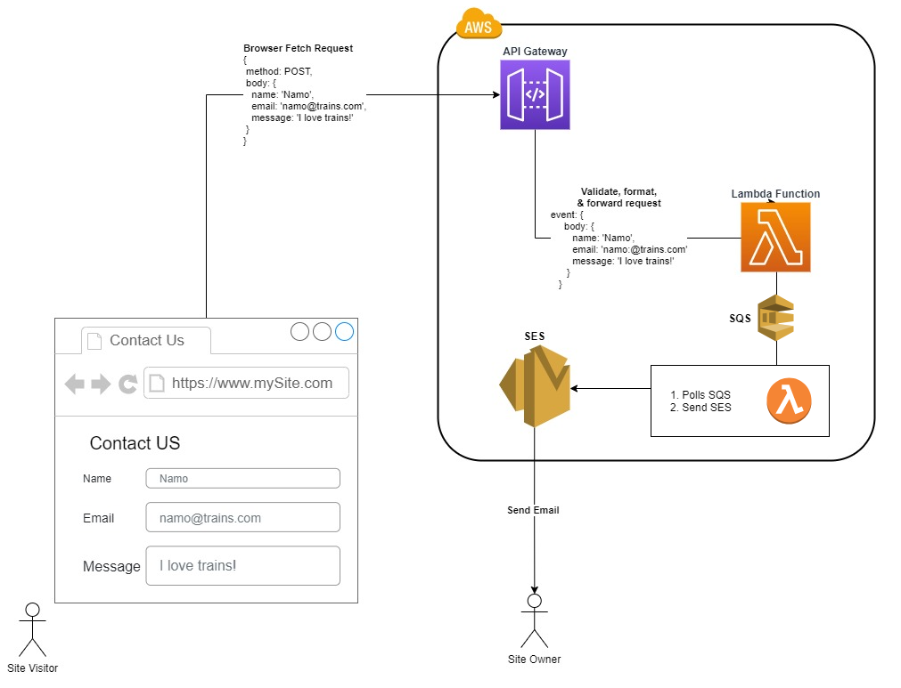

# Homework bonus - SQS, SNS, Node JS

### SQS ашиглан имэйл илгээгч бүтээх жишээ
- AWS Lambda
- Node JS 
- API Gateway
- SQS
- SES
- SNS

## Ажил 1 - SQS үүсгэж турших
SQS цэс рүү орж Web console-оор **test_sqs_queue** үүсгэж турших.
Тохиргоонуудыг сайн ажиглаж уншаарай. 
Web Console-оор message шидэж туршиж үзээрэй. 
Poll message хийж туршиж үзээрэй.

    sqs_sendmessage.js
**QUEUE_URL-г сольж тавихаа мартаваа!**
файл дээр байгаа кодыг өөр дээрээ татаж авч ажиллуулж кодын аргаар Queue insert хийж үзээрэй.

**Ингэхийн тулд**
- AWS CLI - SQS push хийх эрх бүхий credential буюу Access key, secret key тааруулсан байх - [Эндээс AWS CLI суулгана](https://docs.aws.amazon.com/cli/latest/userguide/install-cliv2-windows.html)
- Node суулгах - [Эндээс суулгана](https://nodejs.org/en/)
- **aws configure** коммандаар тухайн IAM User-н 2 key-г тохируулж өгнө.
- `$User/.aws` directory дотор энэ user profile хадгалаатай байдаг шүү.

Кодыг ажиллуулахын тулд

    node ./sqs_sendmessage.js
Командаар ажиллуулна.
Ингэхийн өмнө шаардагдах package-ууд буюу node_modules суух ёстой бөгөөд:

- `npm i aws-sdk --save` эсвэл `npm init` & `npm install` командаар суулгах боломжтой.
 ## Ажил 2 - SQS poll хийх
    node ./sqs_recievemessage.js
кодыг ажиллуулаарай.
**QUEUE_URL-г сольж тавихаа мартаваа!**

 ## Ажил 3 - SQS sender application хийх

Туршилтын демо бичлэг - https://www.youtube.com/watch?v=lx3sVInltrs

Дээрх архитектурын дагуу:

- Email SQS рүү push хийдэг `sqs_pusher` Lambda функц суулгах. Ингэхдээ яг зохион SQSFullAccess **Role** үүсгэж уях - Эх код нь `lambda_sqs_push_email.js` дээр байна.
- Тухайн Lambda-г API Gateway **Post** URL гаргаж `index.html` дээр сольж тавих.
- **my_email** нэртэй SQS үүсгэж URL-г `sqs_pusher` Lambda функц дээр Environment variable дээр QUEUE_URL гэсэн нэртэйгээр оруулж тавих.
- SES тохируулж sandbox-оос гаргах эсвэл илгээгч болон хүлээн авагч имэйл verify хийх 
- Email илгээдэг `email_sender` Lambda функц үүсгэх. Эх код нь `lambda_final_sender.js` дээр байна.
- Энд SNS илгээж байгаа кодыг түр коммент болгож тавиарай дараа нь туршина.
- Хэрэгтэй **Role**-г үүсгэж холбоорой.
- Илгээж буй имэйл буюу компанийн захирал Validate хийсэн имэйл байх ёстойг анхаарна уу. Тиймээс код дээр өөрчлөлт оруулж болно шүү.
- Үүсгэсэн SQS функцийн trigger дээр уг Lambda функцийг уяж өгнө үү.
- `index.html`-г өөрийн PC дээр ажилуулж имэйл явж буй эсэхийг шалгана уу.
- SNS topic үүсгэж хэд хэдэн subscriber үүсгэж Lambda дээрээ коммент болгосон хэсгийг авч ажиллаж буй эсэхийг туршиж үзнэ үү.
